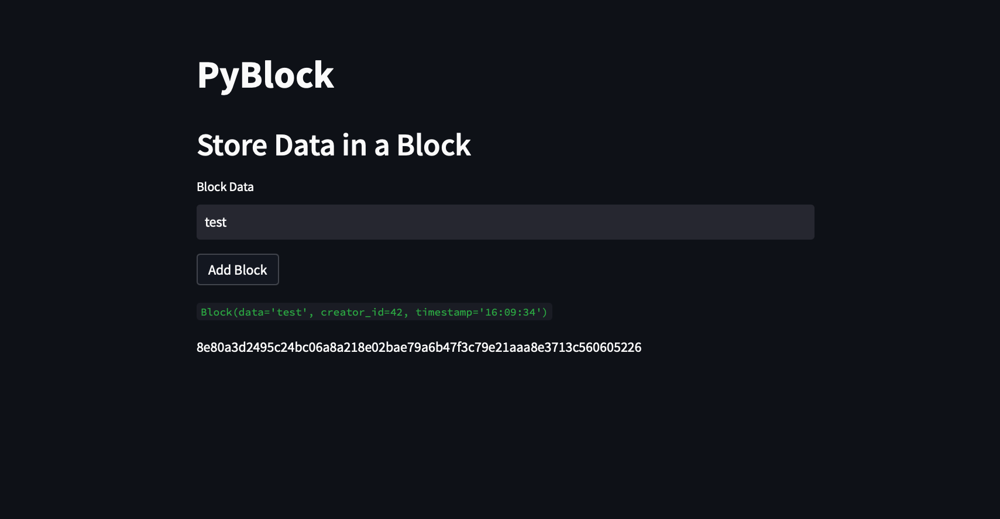
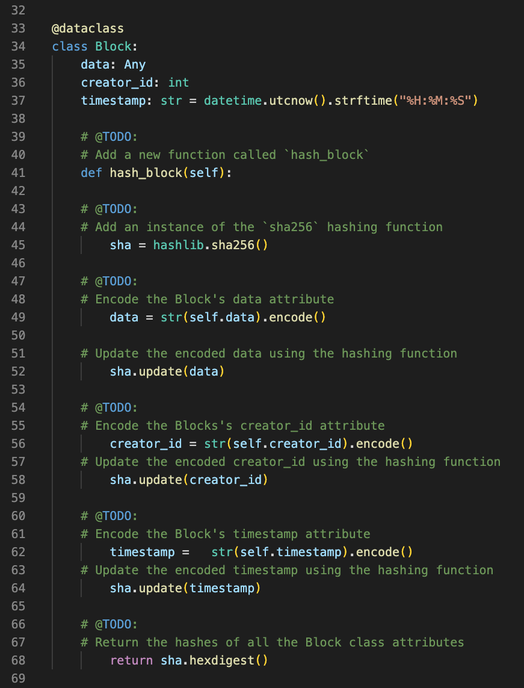

`Blockchain` *build a blockchain-based ledger system, complete with a user-friendly web **interface**. This ledger should allow partner banks to conduct financial transactions (that is, to transfer ``money`` between **senders and receivers**) and to verify the integrity of the data in the ledger*.
 
➙ [click here](https://www.ledger.com/academy/blockchain/what-is-blockchain) to learn more about Blockchain 🤯 

 ## Blockchain-using-Streamlit 🖊
  
  # STEP 1

**Hash Block** `Frequently` used to verify a file’s authenticity 

➙ [click here](https://hackernoon.com/wtf-is-hashing-in-blockchains-z6f836i1) to learn more about hashing in Blockchain 🤯 

