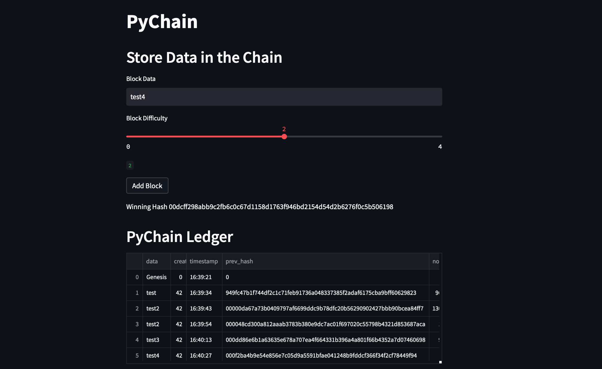
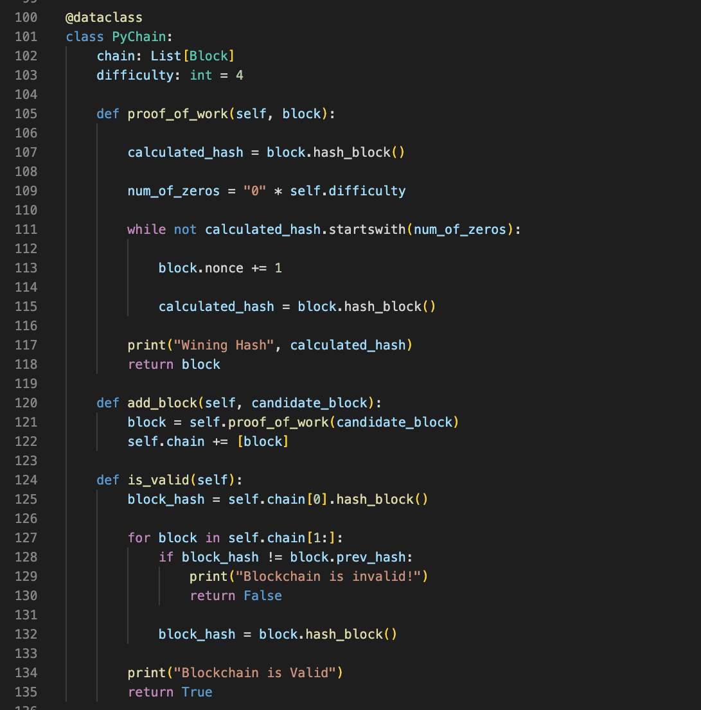
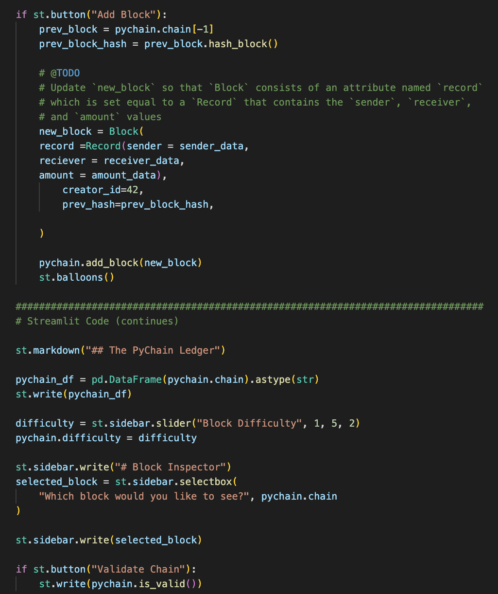
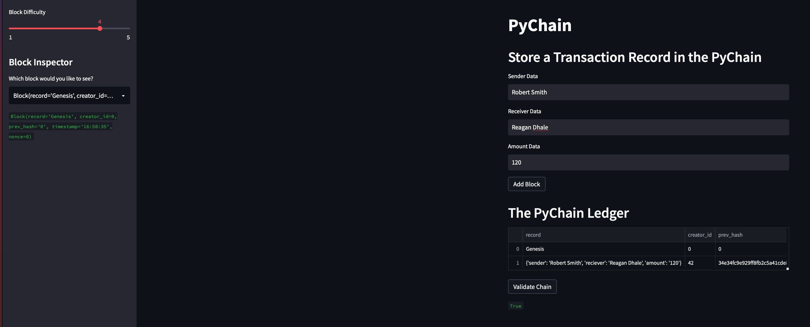

`Build` a **blockchain-based** *ledger system, complete with a user-friendly web **interface**. This ledger should allow partner banks to conduct financial transactions (that is, to transfer ``money`` between **senders and receivers**) and to verify the integrity of the data in the ledger*.
 
➙ [click here](https://www.ledger.com/academy/blockchain/what-is-blockchain) to learn more about Blockchain 🤯 

 ## Blockchain-using-Streamlit 🖊
  
  # STEP 1

**Hash Chained Block** `Frequently` used to verify a file’s authenticity 

➙ [click here](https://hackernoon.com/wtf-is-hashing-in-blockchains-z6f836i1) to *learn more*  about **hashing** in `Blockchain` 🤯 

  # STEP 2
 
 **Proof of Work system** is used for `difficulty` for *miners* 

 ➙ [click here](https://www.investopedia.com/terms/p/proof-work.asp) to learn more about **POW** in `Blockchain` 🤯 

 

 

   # STEP 3

   **Build Streamlit interface**

   ➙ [click here](https://docs.streamlit.io/library/get-started/create-an-app) to learn more about `Streamlit` 🤯 

   # STEP 4

   **Test Application**

   

## REQUIRMENTS
[PYTHON](https://www.python.org/downloads/)

[STREAMLIT](https://streamlit.io)

## INSTALLATION

[ZIP FILE](https://github.com/brprod8/Blockchain-using-Streamlit/archive/refs/heads/main.zip)

[CLONE REPO](https://github.com/brprod8/Blockchain-using-Streamlit)

## LICENSE

**Open to Experiemnt**

BY:Robert Smith

Credit:UC BERKELEY

Email : Roberts.track@yahoo.com

     

    
